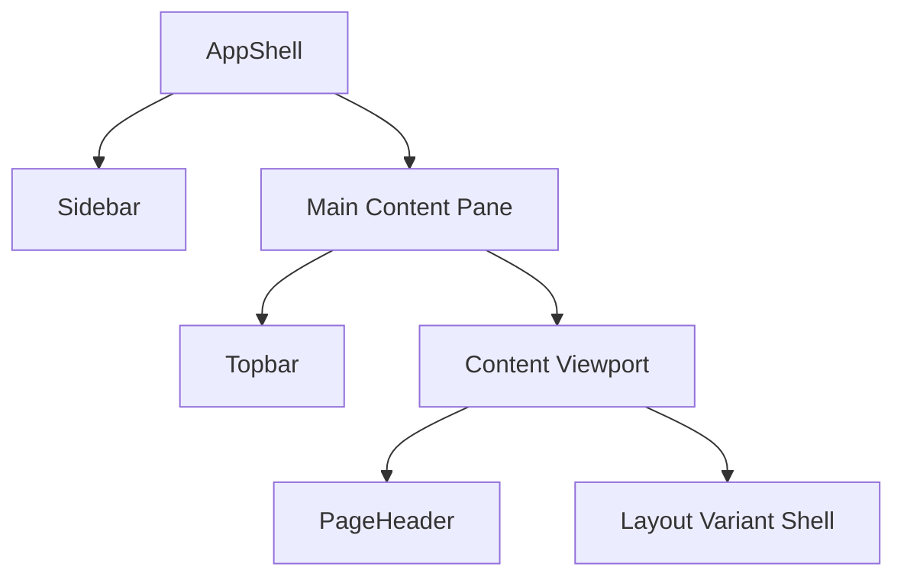

# Application Shell Specifications (AppShell)

The `AppShell` represents the unified layout framework for the Adarsh ID Panel platform. It coordinates the global navigation, search context, session metadata, and responsive content viewports.

---

## 1. Structure Overview
The layout is built using a desktop-first Flexbox model:
- **Sidebar**: Fixed on the left, always visible, non-collapsible.
- **Topbar**: Fixed at the top, managing user menu context and search triggers.
- **Content Area**: Fluid scrollable viewport that holds child route content.

---

## 2. Sidebar Width Evaluation
We evaluated three width options for the main sidebar:

| Width | Evaluation | Decision |
| :--- | :--- | :--- |
| **260px** | Too narrow. Under the wide `Saira Condensed` typography, long links or submenus wrap aggressively. | Rejected |
| **280px** | **Optimal balance**. Provides enough horizontal space for uppercase labels and submenus without crowding the viewport on a 1000px min-width screen (leaving 720px for content). | **Selected** |
| **300px** | Too wide. Consumes 30% of the screen at a 1000px viewport, reducing workspace density. | Rejected |

---

## 3. Responsive Breakpoint Rules
The shell remains rigid on the sidebar and scales the content pane:
- **1000px (Minimum supported)**: Sidebar (280px) + Content Pane (720px). Zero horizontal scrolling.
- **1280px**: Sidebar (280px) + Content Pane (1000px).
- **1440px**: Sidebar (280px) + Content Pane (1160px).
- **1920px**: Sidebar (280px) + Content Pane (1640px). Max-width container of 7xl limits line stretching.

---

## 4. Auth Layout & Centering Rules
The Authentication flow uses a specialized viewport framing structure (`AuthLayout` and `AuthCard`):
- **Card Sizing**: 
  - Width: **640px** (strict `min-w-[640px]`, `max-w-[640px]`, `w-[640px]`).
- **Centering**:
  - Vertical: Flexbox items-center on `min-h-screen`.
  - Horizontal: Flexbox justify-center on `w-screen`.
- **Styling Specs**:
  - Radius: **6px** (`rounded-lg`).
  - Borders: 1px solid (`border-border`), high-density structure.
- **Flow Elements**:
  - Contains `WizardStepIndicator` displaying progress through: **Identity -> Password -> OTP -> Success**.

---

## 5. Compact Operational Density
Both the Sidebar and Topbar are designed to match the compact density of production screenshots rather than spacious SaaS dashboard patterns:
- Control gaps: **8px / 12px** max.
- Vertical padding on lists: **6px / 8px**.
- Borders and dividers act as segment isolators instead of blank whitespace.
