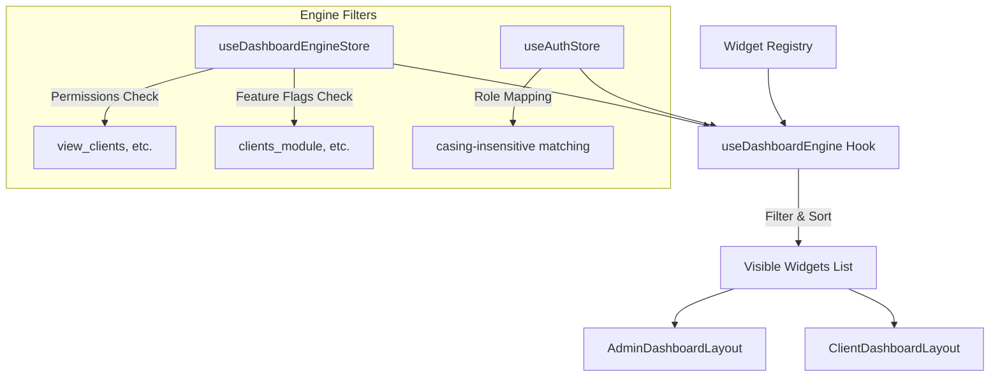

# Dashboard Architecture Engine

This document provides a technical overview of the dashboard system built in Phase 3A.

## Overview
The dashboard system uses a decoupled, configuration-driven registry pattern. Rather than importing and hardcoding widgets directly within layout grids, widgets are registered in a centralized registry and filtered by a visibility resolver before rendering.

---

## Visibility Engine
The visibility of any dashboard block is computed dynamically on each render pass through the `useDashboardEngine` hook:

1. **Role Matching**:
   * Standardizes roles into uppercase.
   * Compares user role against authorized role constraints declared in widget config.
2. **Global Enable Switch**:
   * Evaluates the widget `enabled` property.
3. **Permissions Check**:
   * Inspects permissions stored in the engine state. If the widget demands permissions, the user must satisfy *all* of them.
4. **Feature Flag Check**:
   * Validates active feature flag toggles against the widget config.

If any check fails, the widget is excluded from the visible widgets array, and the layout reflows automatically.

---

## Layout Composition & Reflow
We enforce strict separation between user role dashboards. Layout engines do not share structure, which prevents bleed-through:

* **Admin Dashboard (`/dashboard/admin`)**:
  * Utilizes `AdminDashboardLayout` built around six core sections:
    1. Header
    2. Workflow Overview
    3. Analytics Area (2-column layout hosting Clients and Desktop Agents)
    4. Activity Area
    5. Operations Area (2-column layout hosting Reprints and Quick Actions)
    6. System Area
* **Client Dashboard (`/dashboard/client`)**:
  * Utilizes `ClientDashboardLayout` containing:
    1. Header
    2. Workflow Overview
    3. Recent Activity (2-column layout)
    4. Quick Actions
    5. Notifications

If a layout area contains no visible widgets, the section heading and space collapse automatically, ensuring no empty gaps or misplaced placeholders.
