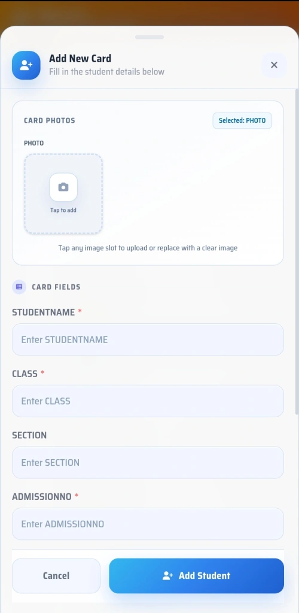
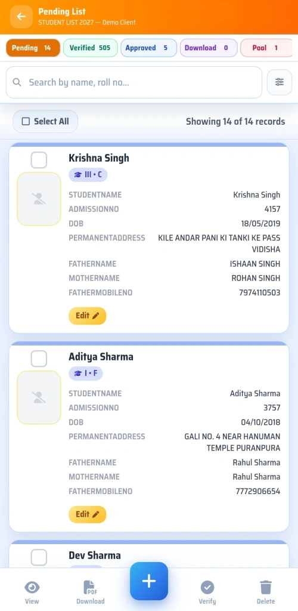
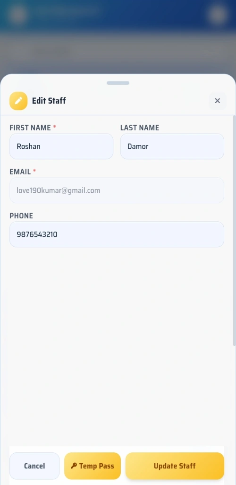
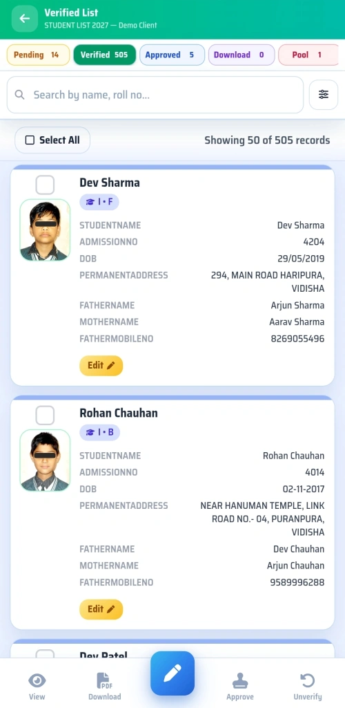
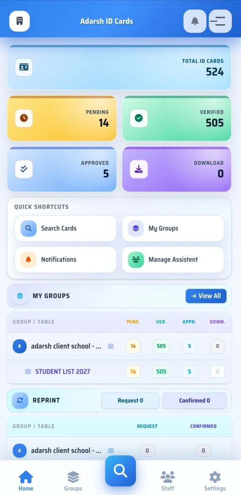
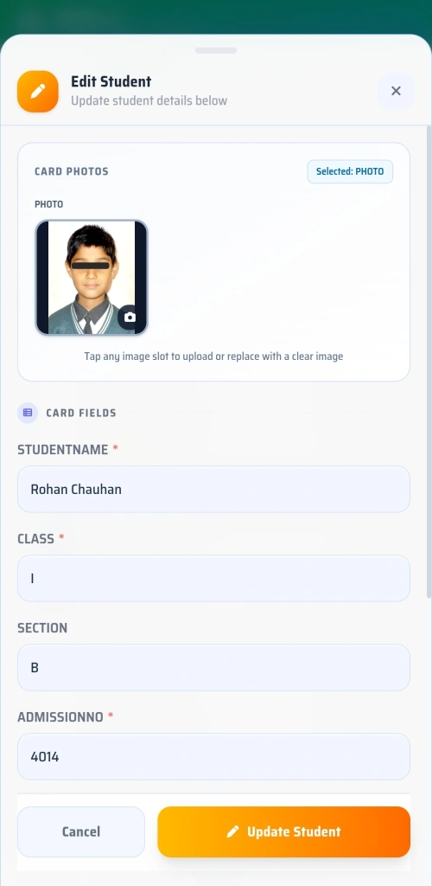

# 🎴 CardFlow ID Cards — Enterprise Management Platform

A high-performance, production-grade ID card operations platform designed for schools, colleges, institutions, and enterprise organizations.

> **Live Production Panel**: [https://panel.adarshbhopal.in](https://panel.adarshbhopal.in) | **Current Build Version**: `v4.19.01`

---

## 🌟 Feature Showcase & Visual Interface

CardFlow brings together web management, real-time biometrics, dynamic template engines, and automated export pipelines.

### 🖼️ Grid 1: Control Panel & Organization Schema Management

<table width="100%">
  <tr>
    <td width="50%" align="center">
      
      <br/><sub><b>Multi-Tenant Institution Management</b></sub>
    </td>
    <td width="50%" align="center">
      
      <br/><sub><b>Dynamic Card Schema & Field Design Lab</b></sub>
    </td>
  </tr>
  <tr>
    <td width="50%" align="center">
      
      <br/><sub><b>Client Dashboard & Operations Analytics</b></sub>
    </td>
    <td width="50%" align="center">
      
      <br/><sub><b>Card Data Table & Real-Time Search Filters</b></sub>
    </td>
  </tr>
</table>

---

### 📱 Grid 2: Mobile Companion App & Real-Time Camera Biometrics

<table width="100%">
  <tr>
    <td width="50%" align="center">
      
      <br/><sub><b>Mobile Home Screen & Role-Based Actions</b></sub>
    </td>
    <td width="50%" align="center">
      
      <br/><sub><b>Real-Time Optical Camera Biometrics Scanner</b></sub>
    </td>
  </tr>
  <tr>
    <td width="50%" align="center">
      
      <br/><sub><b>Mobile Student & Staff Directory</b></sub>
    </td>
    <td width="50%" align="center">
      
      <br/><sub><b>Student Profile & Media Detail View</b></sub>
    </td>
  </tr>
</table>

---

### 🖨️ Grid 3: Printing, Reprint Queues & Status Workflows

<table width="100%">
  <tr>
    <td width="50%" align="center">
      
      <br/><sub><b>Reprint Request Approval & Status Queue</b></sub>
    </td>
    <td width="50%" align="center">
      
      <br/><sub><b>Status Pipeline (Pending ➔ Approved ➔ Pool)</b></sub>
    </td>
  </tr>
  <tr>
    <td width="50%" align="center">
      
      <br/><sub><b>Batch Production Print Job Tracking</b></sub>
    </td>
    <td width="50%" align="center">
      
      <br/><sub><b>Instant QR Code & Digital Verification</b></sub>
    </td>
  </tr>
</table>

---

### ⚡ Grid 4: Bulk Ingestion, Export Engine & OpenCV Cropper

<table width="100%">
  <tr>
    <td width="50%" align="center">
      
      <br/><sub><b>Automated OpenCV Face Cropping Engine</b></sub>
    </td>
    <td width="50%" align="center">
      
      <br/><sub><b>3D Card Lanyard & Physical Mockup Engine</b></sub>
    </td>
  </tr>
  <tr>
    <td width="50%" align="center">
      
      <br/><sub><b>Multi-Image ZIP & Excel Bulk Ingestion</b></sub>
    </td>
    <td width="50%" align="center">
      
      <br/><sub><b>PDF Grid Printing & Word (.docx) Exporters</b></sub>
    </td>
  </tr>
</table>

---

## 📚 In-Depth Technical Documentation

For complete technical specifications, architecture diagrams, and operational guides, explore our dedicated documentation in [`docs/`](docs/):

- 🏗️ [**System Architecture & Topology Guide**](docs/SYSTEM_ARCHITECTURE.md): Deep dive into Django 5.2, React 18 SPA, Daphne WebSockets, Celery task workers, Redis caching, and zero-trust security middleware.
- ⚙️ [**Core Features & Workflows Guide**](docs/FEATURES_AND_WORKFLOWS.md): Detailed workflows covering dynamic schema design, card status transitions (`pending ➔ verified ➔ pool ➔ approved`), reprint queues, and multi-tenant roles.
- ⚡ [**Bulk Ingestion, Face Cropper & Export Engine Guide**](docs/BULK_INGESTION_AND_EXPORTS.md): Complete guide to semantic image matching, standalone PyInstaller OpenCV Face Cropper, PDF grid printing, and Word `.docx` section page breaks.
- 📱 [**Mobile Companion App Guide**](docs/MOBILE_APP_COMPANION.md): Technical overview of the Expo React Native app, native SVG iconography, real-time optical biometric scanner, and Android build specs.

---

## 🛠️ Quick Tech Stack Summary

| Layer | Primary Technology |
|---|---|
| **Backend Framework** | Django 5.2.12 (Python 3.11+) |
| **Frontend Web SPA** | React 18, Vite, Vanilla CSS + Tailwind |
| **Mobile App** | React Native / Expo (Native SVG Icons) |
| **Database & Cache** | PostgreSQL (Prod) / SQLite (Dev) + Redis Cache |
| **Task Queue & Async** | Celery + Channels WebSockets (ASGI) |
| **Media Processing** | OpenCV, Pillow, PyInstaller Face Cropper |
| **Exports** | ReportLab, WeasyPrint, openpyxl, python-docx |

---

## 🚀 Quick Start Setup

### Backend (Django)
```bash
python -m venv venv
.\venv\Scripts\activate
pip install -r requirements.txt
python manage.py migrate
python manage.py runserver
```

### Frontend Web SPA (React 18)
```bash
cd frontend
npm install
npm run dev
```

---

## 📄 License & Intellectual Property

All rights reserved. Property of **CardFlow Platform / Adarsh ID Cards**.

- Mobile upload timeout hardening for 3-image updates.
- Dashboard caching/runtime optimization improvements.
- Mobile action overlay and image upload regression fixes.

```bash
git log --oneline
```

---

## License

Proprietary. All rights reserved.

Unauthorized copying, distribution, or modification is prohibited.
